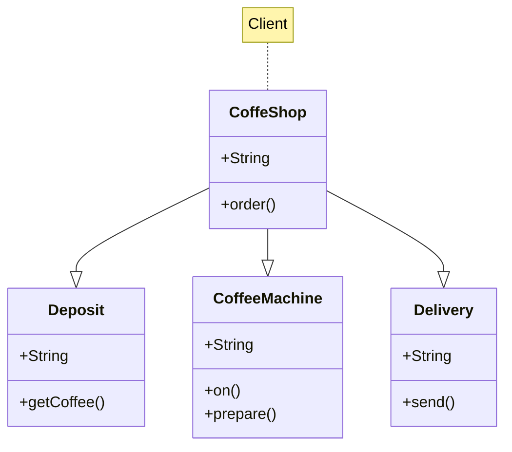

# Design Pattern

## Facade
O Facade é um padrão de projeto estrutural que fornece uma interface simplificada para uma biblioteca, um framework, ou qualquer conjunto complexo de classes.

---
### Propósito
Imagine que você precisa fazer seu código funcionar com um amplo conjunto de objetos que pertencem a uma sofisticada biblioteca ou framework. Normalmente, você precisaria inicializar todos aqueles objetos, rastrear as dependências, executar métodos na ordem correta, e assim por diante.

Como resultado, a lógica de negócio de suas classes vai ficar firmemente acoplada aos detalhes de implementação das classes de terceiros, tornando difícil compreendê-lo e mantê-lo.

---
### Problema
Uma fachada é uma classe que fornece uma interface simples para um subsistema complexo que contém muitas partes que se movem. Uma fachada pode fornecer funcionalidades limitadas em comparação com trabalhar com os subsistemas diretamente. Contudo, ela inclui apenas aquelas funcionalidades que o cliente se importa.

Ter uma fachada é útil quando você precisa integrar sua aplicação com uma biblioteca sofisticada que tem dúzias de funcionalidades, mas você precisa de apenas um pouquinho delas.

Por exemplo, uma aplicação para uma cafeteria onde o cliente só deseja realizar o pedido, e ele não está interessado em ter que pegar o café no deposito, ligar a máquina de café e prepará-lo, e ter que pegar o café para levar até o balcão. Contudo, tudo que ela realmente precisa é uma classe com um único método codificar(nomeDoArquivo, formato). Com uma classe de fachada, esse trabalho é todo resumido em uma única ação.

---
### Solução
