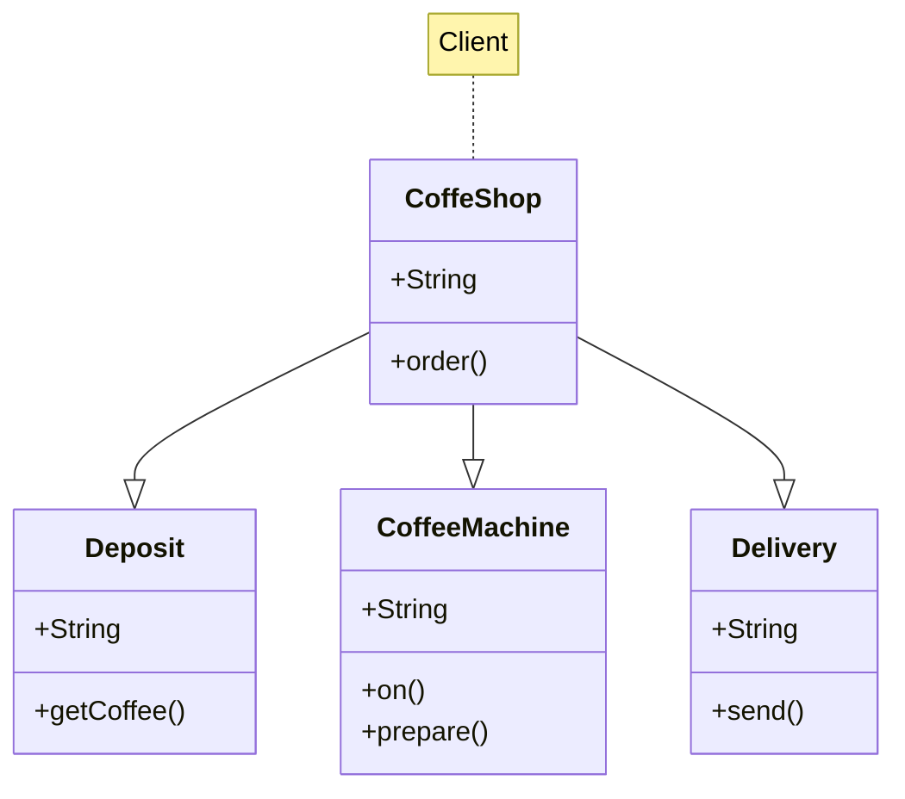

[Voltar](../README.md)
## Factory
O Facade é um padrão de projeto estrutural que fornece uma interface simplificada para uma biblioteca, um framework, ou qualquer conjunto complexo de classes.

---
### Propósito
O Factory Method é um padrão criacional de projeto que fornece uma interface para criar objetos em uma superclasse, mas permite que as subclasses alterem o tipo de objetos que serão criados.

---
### Problema
Imagine que você está criando uma aplicação de gerenciamento de logística. A primeira versão da sua aplicação pode lidar apenas com o transporte de caminhões, portanto a maior parte do seu código fica dentro da classe Caminhão.

Depois de um tempo, sua aplicação se torna bastante popular. Todos os dias você recebe dezenas de solicitações de empresas de transporte marítimo para incorporar a logística marítima na aplicação.

Boa notícia, certo? Mas e o código? Atualmente, a maior parte do seu código é acoplada à classe Caminhão. Adicionar Navio à aplicação exigiria alterações em toda a base de código. Além disso, se mais tarde você decidir adicionar outro tipo de transporte à aplicação, provavelmente precisará fazer todas essas alterações novamente.

Como resultado, você terá um código bastante sujo, repleto de condicionais que alteram o comportamento da aplicação, dependendo da classe de objetos de transporte.

---
### Solução
