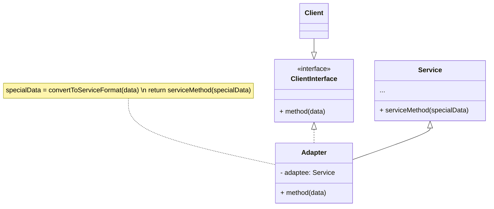
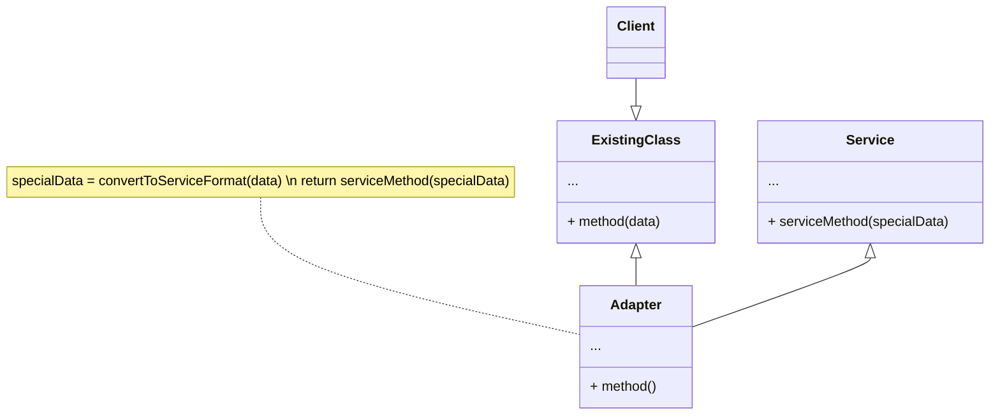

[Voltar](../../README.md)

---
### Propósito
O Adapter é um padrão de projeto estrutural que permite objetos com interfaces incompatíveis colaborarem entre si.
---
### Problema
Imagine que você está criando uma aplicação de monitoramento do mercado de ações da bolsa. A aplicação baixa os dados as ações de múltiplas fontes em formato XML e então mostra gráficos e diagramas maneiros para o usuário.

Em algum ponto, você decide melhorar a aplicação ao integrar uma biblioteca de análise de terceiros. Mas aqui está a pegadinha: a biblioteca só trabalha com dados em formato JSON.

Você poderia mudar a biblioteca para que ela funcione com XML. Contudo, isso pode quebrar algum código existente que depende da biblioteca. E pior, você pode não ter acesso ao código fonte da biblioteca para começo de conversa, fazendo dessa abordagem uma tarefa impossível.

---
### Solução

#### Estrutura

##### *Adaptador de objeto*
Essa implementação usa o princípio de composição do objeto: o adaptador implementa a interface de um objeto e encobre o outro. Ele pode ser implementado em todas as linguagens de programação populares.

##### *Adaptador de classe*
Essa implementação utiliza herança: o adaptador herda interfaces de ambos os objetos ao mesmo tempo. Observe que essa abordagem só pode ser implementada em linguagens de programação que suportam herança múltipla, tais como C++.

