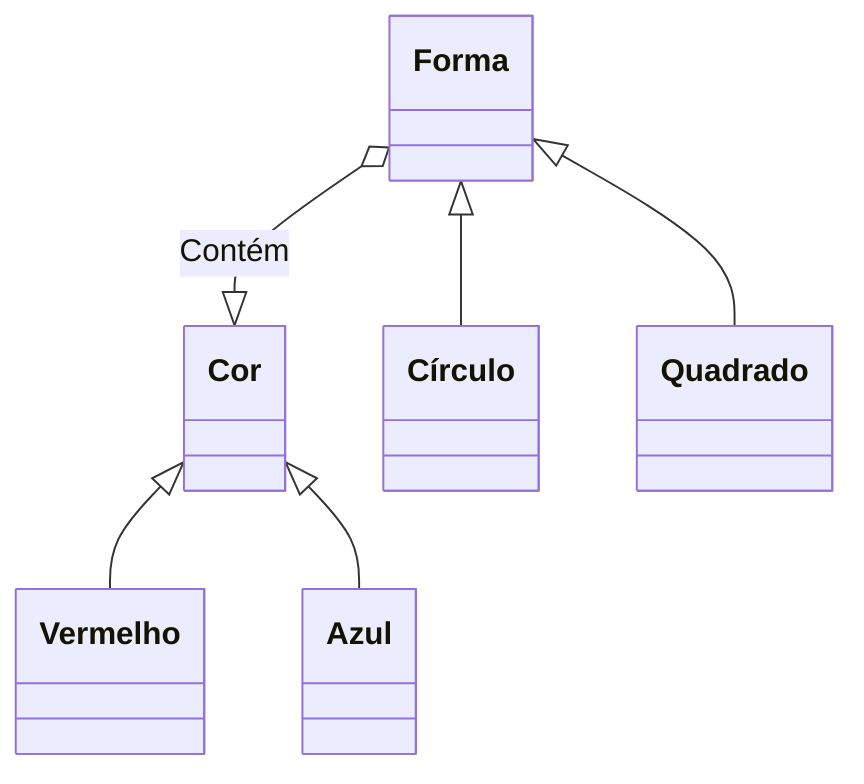
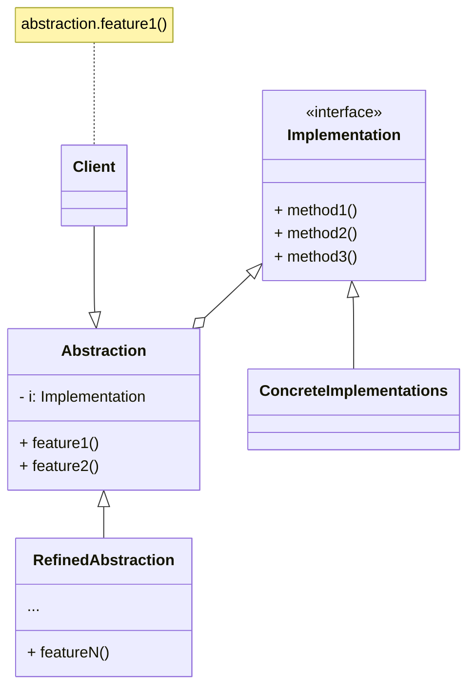

[Voltar](../../README.md)

---
### Propósito
O Bridge é um padrão de projeto estrutural que permite que você divida uma classe grande ou um conjunto de classes intimamente ligadas em duas hierarquias separadas—abstração e implementação—que podem ser desenvolvidas independentemente umas das outras.

---
### Problema
Abstração? Implementação? Soam um pouco assustadoras? Fique calmo que vamos considerar um exemplo simples.

Digamos que você tem uma classe Forma geométrica com um par de subclasses: Círculo e Quadrado. Você quer estender essa hierarquia de classe para incorporar cores, então você planeja criar as subclasses de forma Vermelho e Azul. Contudo, já que você já tem duas subclasses, você precisa criar quatro combinações de classe tais como CírculoAzul e QuadradoVermelho.

Adicionar novos tipos de forma e cores à hierarquia irá fazê-la crescer exponencialmente. Por exemplo, para adicionar uma forma de triângulo você vai precisar introduzir duas subclasses, uma para cada cor. E depois disso, adicionando uma nova cor será necessário três subclasses, uma para cada tipo de forma. Quanto mais longe vamos, pior isso fica.

---
### Solução
Esse problema ocorre porque estamos tentando estender as classes de forma em duas dimensões diferentes: por forma e por cor. Isso é um problema muito comum com herança de classe.

O padrão Bridge tenta resolver esse problema ao trocar de herança para composição do objeto. Isso significa que você extrai uma das dimensões em uma hierarquia de classe separada, para que as classes originais referenciem um objeto da nova hierarquia, ao invés de ter todos os seus estados e comportamentos dentro de uma classe.

Seguindo essa abordagem nós podemos extrair o código relacionado à cor em sua própria classe com duas subclasses: Vermelho e Azul. A classe Forma então ganha um campo de referência apontando para um dos objetos de cor. Agora a forma pode delegar qualquer trabalho referente a cor para o objeto ligado a cor. Aquela referência vai agir como uma ponte entre as classes Forma e Cor. De agora em diante, para adicionar novas cores não será necessário mudar a hierarquia da forma e vice versa.
#### Estrutura

1. A Abstração fornece a lógica de controle de alto nível. Ela depende do objeto de implementação para fazer o verdadeiro trabalho de baixo nível.

2. A Implementação declara a interface que é comum para todas as implementações concretas. Um abstração só pode se comunicar com um objeto de implementação através de métodos que são declarados aqui.

    A abstração pode listar os mesmos métodos que a implementação, mas geralmente a abstração declara alguns comportamentos complexos que dependem de uma ampla variedade de operações primitivas declaradas pela implementação.

3. Implementações Concretas contém código plataforma-específicos.

4. Abstrações Refinadas fornecem variantes para controle da lógica. Como seu superior, trabalham com diferentes implementações através da interface geral de implementação.

5. Geralmente o Cliente está apenas interessado em trabalhar com a abstração. Contudo, é trabalho do cliente ligar o objeto de abstração com um dos objetos de implementação.
